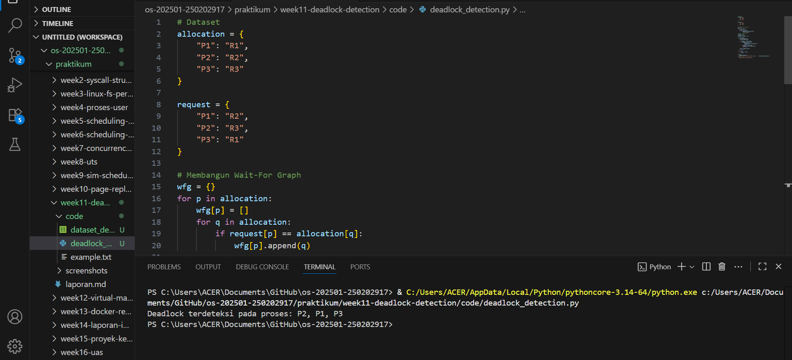

# Laporan Praktikum Minggu 11
Topik: Simulasi dan Deteksi Deadlock

---

## Identitas
- **Nama**  : Rafika Rahma
- **NIM**   : 250202917
- **Kelas** : 1 IKRA

---

## Tujuan
Setelah menyelesaikan tugas ini, mahasiswa mampu:
1. Membuat program sederhana untuk mendeteksi deadlock.  
2. Menjalankan simulasi deteksi deadlock dengan dataset uji.  
3. Menyajikan hasil analisis deadlock dalam bentuk tabel.  
4. Memberikan interpretasi hasil uji secara logis dan sistematis.  
5. Menyusun laporan praktikum sesuai format yang ditentukan.

---

## Dasar Teori
1. Deadlock adalah kondisi ketika dua atau lebih proses saling menunggu sumber daya yang sedang dipegang proses lain, sehingga tidak ada proses yang dapat melanjutkan eksekusi.
2. Simulasi deadlock digunakan untuk memodelkan alokasi sumber daya dan interaksi antar proses, sehingga kondisi deadlock dapat dianalisis tanpa harus terjadi pada sistem nyata.
3. Deteksi deadlock dilakukan dengan menggunakan *resource allocation graph* atau matriks alokasi untuk mengidentifikasi adanya siklus yang menandakan deadlock.
4. Algoritma deteksi deadlock membantu sistem operasi menentukan proses mana yang terlibat deadlock agar dapat dilakukan tindakan pemulihan, seperti *preemption* atau penghentian proses.
5. Melalui simulasi dan deteksi deadlock, kinerja dan keandalan sistem dapat ditingkatkan dengan mencegah terhentinya proses secara permanen.

---

## Langkah Praktikum
1. **Menyiapkan Dataset**

   Gunakan dataset sederhana yang berisi:
   - Daftar proses  
   - Resource Allocation  
   - Resource Request / Need

   Contoh tabel:

   | Proses | Allocation | Request |
   |:--:|:--:|:--:|
   | P1 | R1 | R2 |
   | P2 | R2 | R3 |
   | P3 | R3 | R1 |

2. **Implementasi Algoritma Deteksi Deadlock**

   Program minimal harus:
   - Membaca data proses dan resource.  
   - Menentukan apakah sistem berada dalam kondisi deadlock.  
   - Menampilkan proses mana saja yang terlibat deadlock.

3. **Eksekusi & Validasi**

   - Jalankan program dengan dataset uji.  
   - Validasi hasil deteksi dengan analisis manual/logis.  
   - Simpan hasil eksekusi dalam bentuk screenshot.

4. **Analisis Hasil**

   - Sajikan hasil deteksi dalam tabel (proses deadlock / tidak).  
   - Jelaskan mengapa deadlock terjadi atau tidak terjadi.  
   - Kaitkan hasil dengan teori deadlock (empat kondisi).

5. **Commit & Push**

   ```bash
   git add .
   git commit -m "Minggu 11 - Deadlock Detection"
   git push origin main
   ```

---

## Kode / Perintah

```bash
allocation = {
    "P1": "R1",
    "P2": "R2",
    "P3": "R3"
}

request = {
    "P1": "R2",
    "P2": "R3",
    "P3": "R1"
}

wfg = {}
for p in allocation:
    wfg[p] = []
    for q in allocation:
        if request[p] == allocation[q]:
            wfg[p].append(q)

visited = set()
rec_stack = set()
deadlock_processes = set()

def dfs(process):
    visited.add(process)
    rec_stack.add(process)

    for neighbor in wfg[process]:
        if neighbor not in visited:
            if dfs(neighbor):
                deadlock_processes.add(process)
                return True
        elif neighbor in rec_stack:
            deadlock_processes.add(process)
            return True

    rec_stack.remove(process)
    return False

for p in wfg:
    if p not in visited:
        dfs(p)

if deadlock_processes:
    print("Deadlock terdeteksi pada proses:", ", ".join(deadlock_processes))
else:
    print("Tidak terjadi deadlock")
```

---

## Hasil Eksekusi


---

## Eksekusi & Validasi
**Hasil Eksekusi Program**
```bash
Deadlock terdeteksi pada proses: P1, P2, P3
```

**Validasi Manual**
- P1: menunggu R2 (dipegang P2)
- P2: menunggu R3 (dipegang P3)
- P3: menunggu R1 (dipegang P1)
- Terbentuk siklus melingkar
Hasil program sesuai analisis manual

---

## Analisis

| Proses | Status |
| :--- | :--- |
| P1 | Deadlock |
| P2 | Deadlock |
| P3 | Deadlock |

**Kesimpulan:** Semua proses (**P1, P2, dan P3**) terlibat dalam kondisi deadlock.

**Penjelasan Terjadinya Deadlock**

Dari dataset pada program:

**Allocation (resource yang sedang dipegang):**

- P1 memegang R1
- P2 memegang R2
- P3 memegang R3

**Request (resource yang diminta):**

- P1 meminta R2
- P2 meminta R3
- P3 meminta R1

Terjadi **circular wait**:

- P1 menunggu R2 → dipegang P2
- P2 menunggu R3 → dipegang P3
- P3 menunggu R1 → dipegang P1

Tidak ada proses yang bisa melanjutkan eksekusi karena semua saling menunggu.

**Kaitan dengan Teori Deadlock (Empat Kondisi)**

Deadlock terjadi karena semua kondisi Coffman terpenuhi:

1. **Mutual Exclusion**

   Resource hanya dapat digunakan satu proses dalam satu waktu.

2. **Hold and Wait**

   Proses memegang resource sambil menunggu resource lain.

3. **No Preemption**

   Resource tidak dapat diambil paksa.

4. **Circular Wait**

   P1 → P2 → P3 → P1 membentuk siklus.

---

## Kesimpulan
1. Algoritma deteksi deadlock dapat digunakan untuk mengidentifikasi kondisi deadlock dengan menganalisis hubungan tunggu antar proses melalui *wait-for graph*.
2. Deadlock terjadi ketika seluruh empat kondisi Coffman terpenuhi, terutama adanya **circular wait** antar proses.
3. Simulasi deteksi deadlock membantu memahami perilaku sistem operasi secara logis serta memudahkan analisis tanpa harus terjadi deadlock pada sistem nyata.

---

## Quiz
1. Apa perbedaan antara *deadlock prevention*, *avoidance*, dan *detection*?  

**Jawaban:**  

   | Pendekatan | Prinsip Kerja | Waktu Penanganan | Kelebihan | Kekurangan |
   | :--- | :--- | :--- | :--- | :--- | 
   | **Deadlock Prevention** | Mencegah deadlock dengan menghilangkan salah satu kondisi deadlock | Sebelum terjadi | Deadlock tidak pernah terjadi | Penggunaan sumber daya kurang efisien |
   | **Deadlock Avoidance** | Menghindari deadlock dengan menjaga sistem tetap pada *safe state* | Saat permintaan sumber daya | Pemanfaatan sumber daya lebih baik | Membutuhkan informasi maksimum kebutuhan proses |
   | **Deadlock Detection** | Mengizinkan deadlock terjadi lalu mendeteksinya | Setelah terjadi | Fleksibel dan efisien untuk sistem dinamis | Perlu overhead deteksi dan proses pemulihan |

2. Mengapa deteksi deadlock tetap diperlukan dalam sistem operasi?  

**Jawaban:**  

   Karena tidak semua sistem dapat menerapkan pencegahan atau penghindaran secara efisien. Deteksi deadlock memberikan fleksibilitas penggunaan sumber daya dan memungkinkan sistem tetap berjalan optimal meskipun deadlock berpotensi terjadi.

3. Apa kelebihan dan kekurangan pendekatan deteksi deadlock?

**Jawaban:**  

   - Kelebihan:
      - Pemanfaatan sumber daya lebih maksimal
      - Lebih fleksibel dibanding prevention dan avoidance
      - Cocok untuk sistem dengan beban dinamis

   - Kekurangan:
      - Deadlock tetap dapat terjadi
      - Membutuhkan overhead untuk proses deteksi
      - Pemulihan dapat mengganggu proses lain

---

## Refleksi Diri
Tuliskan secara singkat:
- Apa bagian yang paling menantang minggu ini?  

   **Jawaban:**  
   Memahami proses deteksi deadlock dan identifikasi siklus antar proses.

- Bagaimana cara Anda mengatasinya?  

   **Jawaban:**  
   Mempelajari contoh sederhana dan melakukan simulasi berulang.

---

**Credit:**  
_Template laporan praktikum Sistem Operasi (SO-202501) – Universitas Putra Bangsa_
