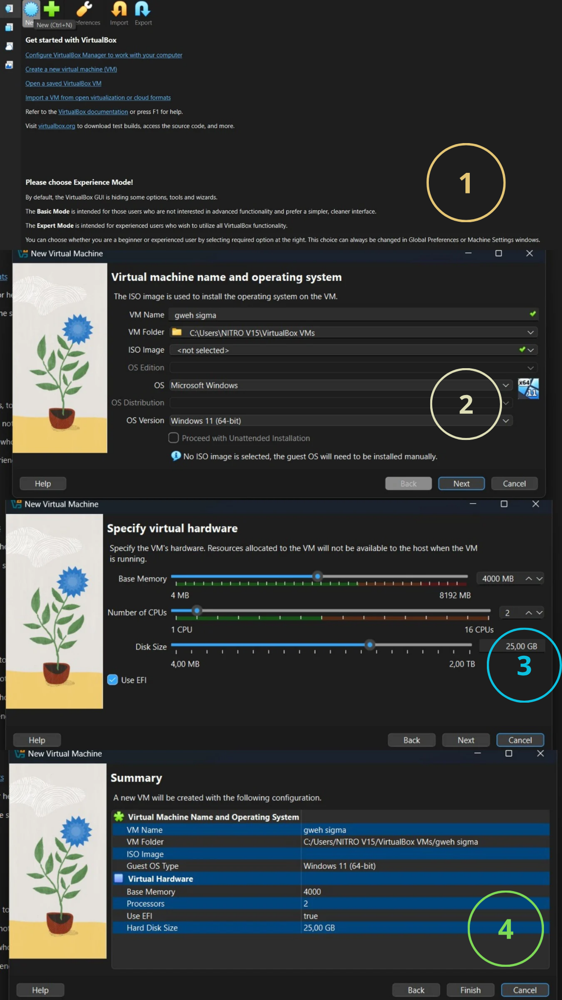
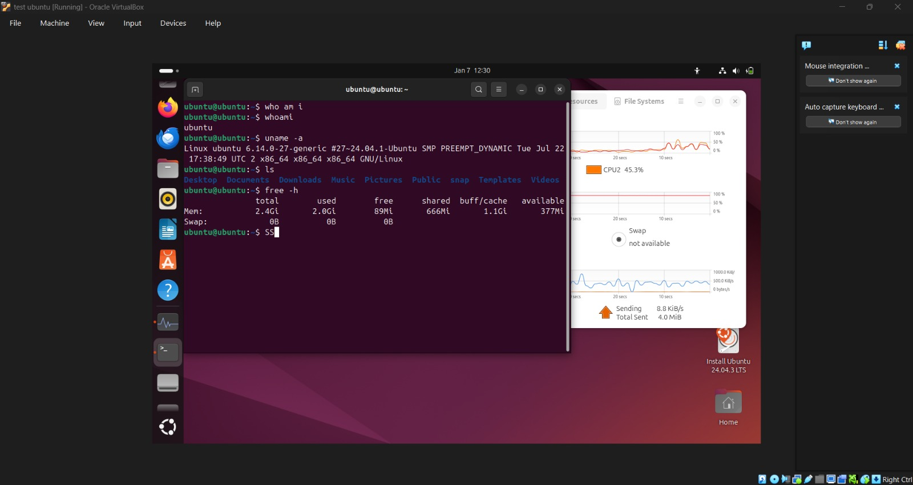
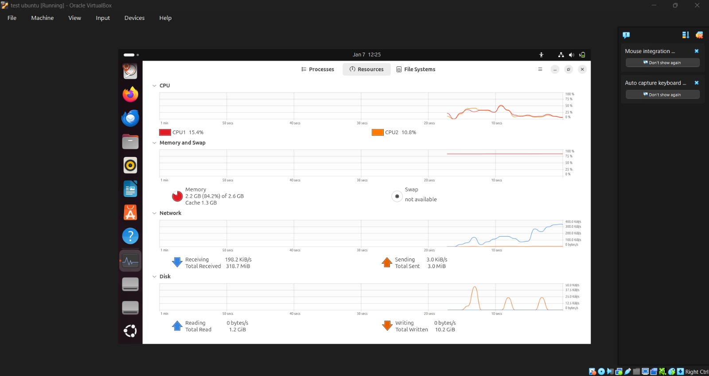

# Laporan Praktikum Minggu 12
Topik: Virtualisasi Menggunakan Virtual Machine

---

## Identitas
- **Nama Anggota Kelompok**  :
1. Faris Azhar(250202978) - Instalasi dan dokumentasi
2. Rafika Rahma (250202917) - Analisis
3. Keysya Ayu Anggita (250202944) - Penyusun laporan dan Quiz

- **Kelas** : 1 IKRA

---

## Tujuan
1. Menginstal perangkat lunak virtualisasi (VirtualBox/VMware).  
2. Membuat dan menjalankan sistem operasi guest di dalam VM.  
3. Mengatur konfigurasi resource VM (CPU, RAM, storage).  
4. Menjelaskan mekanisme proteksi OS melalui virtualisasi.  
5. Menyusun laporan praktikum instalasi dan konfigurasi VM secara sistematis.
   
---

## Dasar Teori
**1. Virtualisasi**

Virtualisasi merupakan teknologi yang memungkinkan satu perangkat keras fisik dibagi menjadi beberapa lingkungan komputasi virtual. Setiap lingkungan virtual dapat menjalankan sistem operasi dan aplikasi secara independen, seolah-olah berjalan pada mesin fisik tersendiri, meskipun seluruhnya berbagi sumber daya yang sama.

**2. Virtual Machine (VM)**

Virtual Machine adalah mesin berbasis perangkat lunak yang meniru fungsi perangkat keras komputer. Di dalam virtual machine, sistem operasi tamu dan aplikasinya dapat berjalan tanpa bergantung langsung pada perangkat keras fisik, sehingga memberikan fleksibilitas, isolasi, dan kemudahan dalam pengelolaan sistem.

**3. Oracle VirtualBox**

Oracle VirtualBox adalah hypervisor tipe 2 yang berjalan di atas sistem operasi host dan digunakan untuk membuat serta menjalankan virtual machine, terutama untuk pembelajaran, pengujian, dan pengembangan sistem.

---

## Langkah Praktikum
1. **Instalasi Virtual Machine**
   - Instal VirtualBox atau VMware pada komputer host.  
   - Pastikan fitur virtualisasi (VT-x / AMD-V) aktif di BIOS.

2. **Pembuatan OS Guest**
   - Buat VM baru dan pilih OS guest (misal: Ubuntu Linux).  
   - Atur resource awal:
     - CPU: 1–2 core  
     - RAM: 2–4 GB  
     - Storage: ≥ 20 GB

3. **Instalasi Sistem Operasi**
   - Jalankan proses instalasi OS guest sampai selesai.  
   - Pastikan OS guest dapat login dan berjalan normal.

4. **Konfigurasi Resource**
   - Ubah konfigurasi CPU dan RAM.  
   - Amati perbedaan performa sebelum dan sesudah perubahan resource.

5. **Analisis Proteksi OS**
   - Jelaskan bagaimana VM menyediakan isolasi antara host dan guest.  
   - Kaitkan dengan konsep *sandboxing* dan *hardening* OS.

6. **Dokumentasi**
   - Ambil screenshot setiap tahap penting.  
   - Simpan di folder `screenshots/`.

7. **Commit & Push**
   ```bash
   git add .
   git commit -m "Minggu 12 - Virtual Machine"
   git push origin main
   ```

---

## Kode / Perintah

```bash
whoami
uname -a
ls
free -h
```

---

## Hasil Eksekusi
Proses Instalasi Virtual Machine
  

Proses Konfigurasi Resource
   

OS guest running  
  
  

---

## Analisis
## 1. Instalasi Sistem Operasi (Guest OS)

- Proses instalasi diawali dengan pemasangan **Oracle VirtualBox versi 7.2.4** pada sistem host Windows. Instalasi dilakukan menggunakan pengaturan default hingga proses selesai tanpa kendala.
- Setelah VirtualBox berhasil terpasang, dilakukan pembuatan **virtual machine (VM)** baru dengan memilih sistem operasi **Ubuntu 24.04 LTS (64-bit)** sebagai guest OS.
- Konfigurasi awal VM meliputi penentuan nama VM, pemilihan file ISO Ubuntu, pengaturan RAM, jumlah CPU, serta kapasitas penyimpanan virtual.
- Proses instalasi Ubuntu berjalan hingga selesai dan sistem berhasil masuk ke desktop.
- Guest OS dapat digunakan secara normal, ditandai dengan:

  * Login berhasil ke sistem
  * Terminal dapat dijalankan
  * Perintah dasar seperti `whoami`, `uname -a`, dan `free -h` berjalan dengan baik

**Kesimpulan:** Instalasi sistem operasi guest berhasil dan Ubuntu berjalan stabil di dalam VirtualBox.

---

## 2. Konfigurasi Resource (CPU dan RAM)

- Pada konfigurasi awal, VM diberikan alokasi RAM dan CPU terbatas sehingga penggunaan memori terlihat cukup tinggi dan mendekati kapasitas maksimal.
- Pemantauan melalui **System Monitor** menunjukkan bahwa sebagian besar RAM telah terpakai dan CPU bekerja pada level sedang.
- Selanjutnya dilakukan perubahan konfigurasi resource dengan meningkatkan:

  * Kapasitas RAM
  * Jumlah core CPU
- Setelah perubahan dilakukan dan VM dijalankan kembali, sistem menunjukkan performa yang lebih baik.
- Penggunaan RAM menjadi lebih longgar, cache meningkat, dan respons sistem terasa lebih cepat terutama saat menjalankan beberapa aplikasi.

### a. Resource Awal

Berdasarkan output terminal dan System Monitor:

* RAM tersedia: ±2,6 GB
* RAM terpakai: ±2,2 GB (≈84%)
* CPU:

  * CPU1 ±15%
  * CPU2 ±10%
  * Swap: tidak tersedia

Kondisi:

* Sistem berjalan, tetapi RAM hampir penuh
* Respons aplikasi terasa standar

### b. Setelah Perubahan Resource

(Setelah RAM/CPU ditingkatkan di Settings VM)
Contoh perubahan:

* RAM: dari 2,6 GB → 4 GB
* CPU: dari 2 → 4 core

Hasil pengamatan:

* Penggunaan RAM turun (lebih banyak free memory)
* Cache meningkat → sistem lebih responsif
* CPU load lebih stabil saat multitasking
* Aplikasi dan System Monitor berjalan lebih lancar

### c. Perbandingan Performa

| Aspek | Sebelum | Sesudah |
| :--- | :--- | :--- |
| RAM usage | Tinggi (84%) | Lebih longgar |
| Respons sistem | Normal | Lebih cepat |
| Multitasking | Terbatas | Lebih stabil |
| CPU load | Fluktuatif | Lebih seimbang |

**Kesimpulan:** Penambahan resource CPU dan RAM memberikan peningkatan performa yang signifikan terhadap guest OS.

---

## 3. Analisis Proteksi Sistem Operasi
### a. Isolasi antara Host dan Guest
- Virtual Machine menyediakan isolasi yang kuat antara sistem host dan guest.
- Guest OS berjalan di atas hardware virtual sehingga tidak memiliki akses langsung ke sistem host.
- Gangguan, error, atau crash pada guest OS tidak memengaruhi sistem host.

### b. Hubungan dengan Konsep Sandboxing
- VM berperan sebagai **sandbox**, yaitu lingkungan terisolasi untuk menjalankan sistem atau aplikasi.
- Sandboxing memungkinkan pengguna melakukan eksperimen, pengujian, atau simulasi tanpa risiko langsung terhadap sistem utama.
- Jika terjadi kesalahan atau ancaman keamanan di guest OS, dampaknya tetap terbatas di dalam VM.

### c. Hubungan dengan Hardening OS
- Virtualisasi mendukung hardening OS melalui pembatasan resource dan akses perangkat.
- Pengaturan seperti pembatasan jaringan, shared folder, dan USB membantu meningkatkan keamanan guest OS.
- Dengan kombinasi VM dan hardening, sistem menjadi lebih aman dan terkontrol.

**Kesimpulan:** Virtual Machine mendukung konsep isolasi, sandboxing, dan hardening OS sehingga meningkatkan keamanan sistem secara keseluruhan.

---

## Kesimpulan

* Instalasi sistem operasi Ubuntu sebagai guest OS pada Oracle VirtualBox berhasil dilakukan dan sistem dapat berjalan dengan stabil serta digunakan secara normal.
* Perubahan alokasi resource CPU dan RAM terbukti berpengaruh terhadap performa guest OS, di mana peningkatan resource menghasilkan sistem yang lebih responsif dan stabil saat multitasking.
* Penggunaan virtual machine memberikan isolasi yang baik antara host dan guest, serta mendukung konsep sandboxing dan hardening OS untuk meningkatkan keamanan sistem.


---

## Quiz
**1. Apa perbedaan antara host OS dan guest OS?** 
* **Host OS** adalah sistem operasi utama yang berjalan langsung di atas perangkat keras fisik dan mengelola seluruh resource komputer.
* **Guest OS** adalah sistem operasi yang berjalan di dalam mesin virtual dan tidak berinteraksi langsung dengan perangkat keras, karena akses resource komputer    diatur oleh hypervisor.

##
**2. Apa peran hypervisor dalam virtualisasi?**

**Hypervisor** berperan sebagai lapisan perantara antara perangkat keras dan sistem operasi guest. Hypervisor bertugas menciptakan, menjalankan, dan mengelola mesin virtual dengan cara mengalokasikan serta mengendalikan penggunaan sumber daya fisik oleh masing-masing sistem operasi tersebut. Selain itu, hypervisor memastikan bahwa setiap mesin virtual terisolasi sehingga tidak dapat mengganggu mesin virtual lain maupun sistem host.

##
**3. Mengapa virtualisasi meningkatkan keamanan sistem?**

Virtualisasi meningkatkan keamanan karena setiap sistem operasi berjalan dalam lingkungan terisolasi, sehingga gangguan atau serangan pada satu mesin virtual tidak memengaruhi sistem lain maupun sistem utama. 
   

---

## Refleksi Diri
Tuliskan secara singkat:
- Apa bagian yang paling menantang minggu ini?  
- Bagaimana cara Anda mengatasinya?  

---

**Credit:**  
_Template laporan praktikum Sistem Operasi (SO-202501) – Universitas Putra Bangsa_
