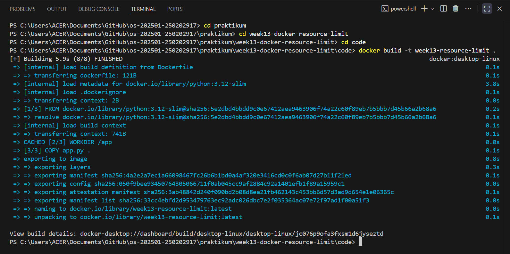
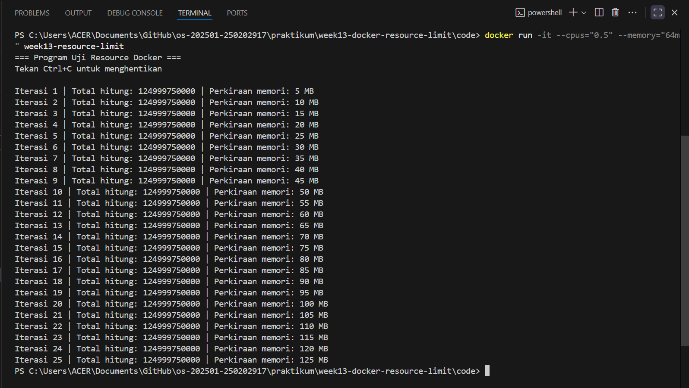
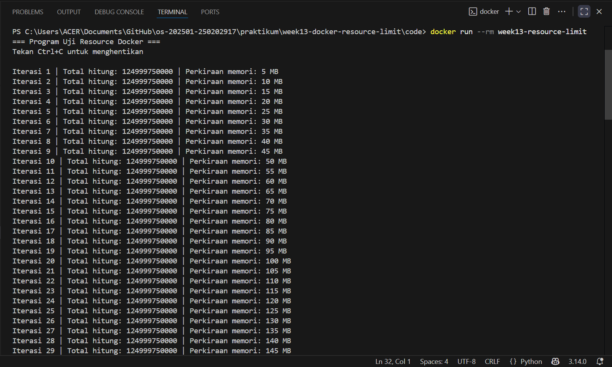
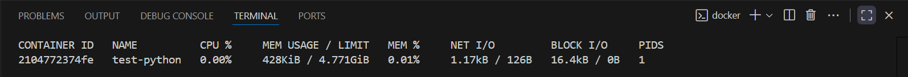

# Laporan Praktikum Minggu 13
Topik: Docker – Resource Limit (CPU & Memori)

---

## Identitas
- **Nama**  : Rafika Rahma
- **NIM**   : 250202917
- **Kelas** : 1 IKRA

---

## Tujuan
Setelah menyelesaikan tugas ini, mahasiswa mampu:
1. Menulis Dockerfile sederhana untuk sebuah aplikasi/skrip.
2. Membangun image dan menjalankan container.
3. Menjalankan container dengan pembatasan **CPU** dan **memori**.
4. Mengamati dan menjelaskan perbedaan eksekusi container dengan dan tanpa limit resource.
5. Menyusun laporan praktikum secara runtut dan sistematis.

---

## Dasar Teori
1. Docker menggunakan cgroups (control groups) pada sistem operasi Linux untuk membatasi dan mengelola penggunaan sumber daya seperti CPU dan memori pada setiap container.
2. Pembatasan CPU memungkinkan container hanya menggunakan sebagian kapasitas CPU (misalnya dengan `--cpus` atau `--cpu-shares`), sehingga mencegah satu container mendominasi CPU.
3. Pembatasan memori dilakukan dengan menetapkan batas RAM (`--memory`), agar container tidak menghabiskan memori sistem secara berlebihan.
4. Jika batas memori terlampaui, container dapat dihentikan secara otomatis (*OOM Killer*) untuk menjaga stabilitas sistem.
5. Resource limit membantu efisiensi dan isolasi, terutama saat banyak container berjalan bersamaan dalam satu host.

---

## Langkah Praktikum
1. **Persiapan Lingkungan**

   - Pastikan Docker terpasang dan berjalan.
   - Verifikasi:
     ```bash
     docker version
     docker ps
     ```

2. **Membuat Aplikasi/Skrip Uji**

   Buat program sederhana di folder `code/` (bahasa bebas) yang:
   - Melakukan komputasi berulang (untuk mengamati limit CPU), dan/atau
   - Mengalokasikan memori bertahap (untuk mengamati limit memori).

3. **Membuat Dockerfile**

   - Tulis `Dockerfile` untuk menjalankan program uji.
   - Build image:
     ```bash
     docker build -t week13-resource-limit .
     ```

4. **Menjalankan Container Tanpa Limit**

   - Jalankan container normal:
     ```bash
     docker run --rm week13-resource-limit
     ```
   - Catat output/hasil pengamatan.

5. **Menjalankan Container Dengan Limit Resource**

   Jalankan container dengan batasan resource (contoh):
   ```bash
   docker run --rm --cpus="0.5" --memory="256m" week13-resource-limit
   ```
   Catat perubahan perilaku program (mis. lebih lambat, error saat memori tidak cukup, dll.).

6. **Monitoring Sederhana**

   - Jalankan container (tanpa `--rm` jika perlu) dan amati penggunaan resource:
     ```bash
     docker stats
     ```
   - Ambil screenshot output eksekusi dan/atau `docker stats`.

7. **Commit & Push**

   ```bash
   git add .
   git commit -m "Minggu 13 - Docker Resource Limit"
   git push origin main
   ```

---

## Kode / Perintah

```bash
docker ps
docker build -t week13-resource-limit .
docker run --rm week13-resource-limit
docker run -it --cpus="0.5" --memory="64m" week13-resource-limit
docker stats
```

**app.py**

```bash
import time

data = []
iterasi = 0

print("=== Program Uji Resource Docker ===")
print("Tekan Ctrl+C untuk menghentikan\n")

try:
    while True:
        total = 0
        for x in range(500_000):
            total += x

        data.append("X" * 5_000_000)
        iterasi += 1

        print(
            f"Iterasi {iterasi} | Total hitung: {total} | "
            f"Perkiraan memori: {iterasi * 5} MB"
        )

        time.sleep(1)

except MemoryError:
    print("ERROR: Memori tidak cukup! Container terkena limit memori.")

except KeyboardInterrupt:
    print("\nProgram dihentikan manual.")
```

**Dockerfile**

```bash
FROM python:3.12-slim

WORKDIR /app
COPY app.py .

CMD ["python", "app.py"]
```

---

## Hasil Eksekusi & Analisis
### 1. Build Image Docker


Pada tahap awal, dilakukan proses build image Docker menggunakan perintah:

```bash
docker build -t week13-resource-limit .
```

Hasil build menunjukkan bahwa image berhasil dibuat tanpa adanya error. Image menggunakan basis `python:3.12-slim` sehingga ukuran image relatif kecil dan efisien. Hal ini menandakan bahwa Dockerfile telah dikonfigurasi dengan benar dan aplikasi uji dapat dijalankan di dalam container.

---

### 2. Menjalankan Container Tanpa Limit Resource


Container dijalankan tanpa pembatasan resource menggunakan perintah:

```bash
docker run --rm week13-resource-limit
```

Berdasarkan hasil eksekusi, program berjalan secara normal dan menampilkan output iterasi yang terus bertambah. Pada setiap iterasi, program melakukan komputasi berulang dan mengalokasikan memori secara bertahap, ditandai dengan meningkatnya nilai perkiraan penggunaan memori (5 MB, 10 MB, hingga lebih dari 100 MB).

Container tidak mengalami error maupun penghentian otomatis. Program hanya berhenti ketika pengguna menghentikannya secara manual menggunakan kombinasi tombol Ctrl+C. Hal ini menunjukkan bahwa tanpa pembatasan resource, container dapat menggunakan memori dan CPU sesuai kapasitas sistem host.

---

### 3. Menjalankan Container dengan Limit Resource


Selanjutnya, container dijalankan dengan pembatasan CPU dan memori menggunakan perintah:

```bash
docker run -it --cpus="0.5" --memory="64m" week13-resource-limit
```

Pada awal eksekusi, program berjalan normal dan menampilkan iterasi yang terus bertambah. Namun, ketika alokasi memori mendekati dan melewati batas 64 MB, container berhenti secara otomatis. Penghentian ini terjadi tanpa intervensi pengguna.

Hal ini menunjukkan bahwa Docker secara aktif membatasi penggunaan memori, dan ketika batas memori terlampaui, sistem akan menghentikan proses di dalam container untuk mencegah penggunaan resource berlebih.

---

### 4. Monitoring dengan `docker stats`


Monitoring penggunaan resource dilakukan menggunakan perintah:

```bash
docker stats
```

Hasil monitoring menunjukkan bahwa:

- Penggunaan CPU relatif rendah.
- Penggunaan memori sangat kecil dibandingkan total memori host (±4,7 GB).
- Container tidak memiliki batasan memori (MEM USAGE / LIMIT menunjukkan limit mengikuti host).

Kondisi ini menandakan bahwa container berjalan bebas tanpa adanya mekanisme pembatasan resource dari Docker.

---

### Perbandingan Hasil Eksekusi
Perbandingan hasil eksekusi container tanpa limit dan dengan limit dapat dilihat pada Tabel berikut:
| Aspek | Tanpa Limit | Dengan Limit |
| :--- | :--- | :--- |
| Batas CPU | Tidak dibatasi | 0.5 Core |
| Batas Memori | Mengikuti host  | 64 MB |
| Perilaku Program | Berjalan terus | Berhenti otomatis |
| Cara Berhenti | Manual (Ctrl+C) | Otomatis (OOM) |
| Risiko terhadap Host | Tinggi | Rendah |

---

## Kesimpulan
1. Docker mampu mengatur dan membatasi penggunaan resource CPU dan memori pada container secara efektif melalui parameter `--cpus` dan `--memory`.
2. Container yang dijalankan tanpa batasan resource dapat menggunakan sumber daya sistem host secara bebas, sedangkan container dengan batasan resource akan dihentikan otomatis ketika melebihi batas yang ditentukan.
3. Penerapan resource limit pada Docker penting untuk menjaga stabilitas sistem dan mencegah penggunaan resource berlebih, terutama pada lingkungan dengan banyak container atau sistem produksi.

---

## Quiz
1. Mengapa container perlu dibatasi CPU dan memori?

   **Jawaban:**  

   Container perlu dibatasi CPU dan memori agar satu container tidak menghabiskan seluruh resource host dan mengganggu container lain, sehingga sistem tetap stabil dan adil.

2. Apa perbedaan VM dan container dalam konteks isolasi resource?

   **Jawaban:**  

   - VM memiliki alokasi resource tetap dan terisolasi penuh melalui hypervisor.
   - Container berbagi kernel host, resource lebih ringan, dan isolasinya diatur secara dinamis menggunakan cgroups.

3. Apa dampak limit memori terhadap aplikasi yang boros memori?

   **Jawaban:**  

   Dampak limit memori terhadap aplikasi boros memori yaitu aplikasi dapat melambat, gagal berjalan, atau dihentikan otomatis (OOM Kill) jika penggunaan memori melebihi batas yang ditentukan.

---

## Refleksi Diri
Tuliskan secara singkat:
- Apa bagian yang paling menantang minggu ini?  

   **Jawaban:**  
   Menentukan batas CPU dan memori yang pas

- Bagaimana cara Anda mengatasinya?  

   **Jawaban:**  
   Menguji beberapa konfigurasi dan memantau dengan `docker stats`

---

**Credit:**  
_Template laporan praktikum Sistem Operasi (SO-202501) – Universitas Putra Bangsa_
