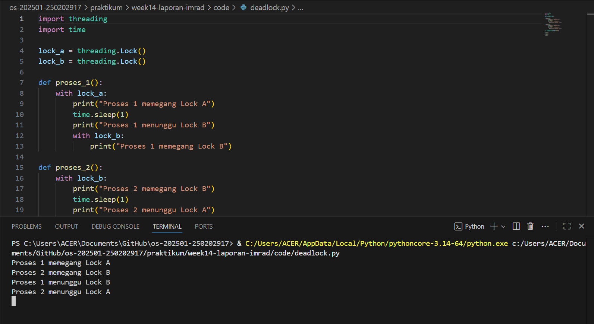

# Laporan Praktikum Minggu 14
Topik: Penyusunan Laporan Praktikum Format IMRAD

---

## Identitas
- **Nama**  : Rafika Rahma
- **NIM**   : 250202917
- **Kelas** : 1 IKRA

---

# Analisis Deadlock Detection pada Sistem Operasi 

---

## 1. Pendahuluan (Introduction)

### 1.1 Latar Belakang

Sistem operasi memiliki peran penting dalam mengelola sumber daya komputer seperti CPU, memori, dan perangkat input/output agar dapat digunakan secara efisien oleh berbagai proses yang berjalan secara bersamaan. Dalam lingkungan multitasking, proses sering kali membutuhkan lebih dari satu sumber daya pada waktu yang sama. Kondisi ini dapat menimbulkan permasalahan dalam pengelolaan sumber daya, salah satunya adalah *deadlock* (Silberschatz et al., 2018).

Deadlock merupakan keadaan ketika dua atau lebih proses saling menunggu sumber daya yang sedang digunakan oleh proses lain, sehingga tidak ada satu pun proses yang dapat melanjutkan eksekusi. Keadaan ini dapat menyebabkan sistem berhenti sebagian atau seluruhnya dan berdampak negatif terhadap kinerja sistem (Tanenbaum & Bos, 2015).

Untuk memahami konsep deadlock secara lebih konkret, diperlukan simulasi yang menggambarkan bagaimana deadlock dapat terjadi. Oleh karena itu, pada praktikum ini dilakukan simulasi deadlock menggunakan program sederhana berbasis Python agar mahasiswa dapat mengamati secara langsung kondisi deadlock dan faktor-faktor penyebabnya.

### 1.2 Rumusan Masalah

Berdasarkan latar belakang tersebut, rumusan masalah dalam praktikum ini adalah:

1. Apa yang dimaksud dengan deadlock dalam sistem operasi?
2. Bagaimana deadlock dapat terjadi pada sistem yang melibatkan beberapa proses dan sumber daya?
3. Apakah simulasi program Python dapat menunjukkan kondisi deadlock sesuai dengan teori sistem operasi?
4. Faktor apa saja yang menyebabkan terjadinya deadlock pada simulasi yang dilakukan?

### 1.3 Tujuan

Tujuan dari praktikum ini adalah:

1. Menjelaskan konsep deadlock dalam sistem operasi.
2. Mensimulasikan terjadinya deadlock menggunakan program Python sederhana.
3. Mengidentifikasi penyebab deadlock berdasarkan empat kondisi deadlock.
4. Membandingkan hasil simulasi dengan teori deadlock dalam sistem operasi.

---

## 2. Metode (Method)

### 2.1 Lingkungan Pengujian

Praktikum ini dilakukan dengan lingkungan sebagai berikut:

* Sistem Operasi: Windows
* Bahasa Pemrograman: Python
* Library: `threading`, `time`
* Metode Eksekusi: Program dijalankan melalui terminal atau *command prompt*

### 2.2 Langkah Eksperimen

Langkah-langkah yang dilakukan dalam praktikum ini meliputi:

1. Membuat dua sumber daya (*resource*) berupa objek *lock*.
2. Membuat dua proses (*thread*) yang masing-masing memegang satu sumber daya.
3. Setiap proses mencoba meminta sumber daya lain yang sedang digunakan oleh proses lain.
4. Mengamati kondisi ketika kedua proses saling menunggu dan program tidak dapat diselesaikan.

### 2.3 Program Uji

Program Python berikut digunakan untuk mensimulasikan kondisi deadlock:

```python
import threading
import time

lock_a = threading.Lock()
lock_b = threading.Lock()

def proses_1():
    with lock_a:
        print("Proses 1 memegang Lock A")
        time.sleep(1)
        print("Proses 1 menunggu Lock B")
        with lock_b:
            print("Proses 1 memegang Lock B")

def proses_2():
    with lock_b:
        print("Proses 2 memegang Lock B")
        time.sleep(1)
        print("Proses 2 menunggu Lock A")
        with lock_a:
            print("Proses 2 memegang Lock A")

t1 = threading.Thread(target=proses_1)
t2 = threading.Thread(target=proses_2)

t1.start()
t2.start()

t1.join()
t2.join()
```

---

## 3. Hasil (Results)


Berdasarkan hasil eksekusi program, diperoleh hasil sebagai berikut:

* Proses 1 berhasil mengunci *Lock A* dan kemudian menunggu *Lock B*.
* Proses 2 berhasil mengunci *Lock B* dan kemudian menunggu *Lock A*.
* Kedua proses saling menunggu sumber daya yang tidak dapat dilepaskan.
* Program berhenti dan tidak dapat menyelesaikan eksekusi.

Hasil tersebut menunjukkan bahwa telah terjadi kondisi **deadlock**, di mana tidak ada proses yang dapat melanjutkan eksekusi.

---

## 4. Pembahasan (Discussion)

Deadlock yang terjadi pada simulasi program disebabkan oleh terpenuhinya keempat syarat deadlock. *Mutual exclusion* terjadi karena setiap *lock* hanya dapat digunakan oleh satu proses dalam satu waktu. *Hold and wait* muncul ketika proses memegang satu sumber daya sambil menunggu sumber daya lain. *No preemption* terlihat karena sumber daya tidak dapat diambil secara paksa. Sementara itu, *circular wait* terjadi karena proses pertama menunggu sumber daya yang dipegang proses kedua dan sebaliknya (Silberschatz et al., 2018).

Hasil simulasi ini sesuai dengan teori deadlock dalam sistem operasi yang menyatakan bahwa deadlock akan terjadi apabila keempat kondisi tersebut terpenuhi secara bersamaan. Simulasi ini membantu memperjelas konsep deadlock secara praktis dan menunjukkan pentingnya strategi pengelolaan sumber daya yang baik dalam sistem operasi (Tanenbaum & Bos, 2015).

---

## 5. Kesimpulan (Conclusion)

Berdasarkan praktikum yang telah dilakukan, dapat disimpulkan bahwa:

1. Deadlock merupakan kondisi saling menunggu antarproses yang menyebabkan sistem tidak dapat melanjutkan eksekusi.
2. Simulasi menggunakan program Python berhasil menunjukkan terjadinya deadlock secara nyata.
3. Deadlock terjadi karena terpenuhinya empat kondisi utama, yaitu *mutual exclusion*, *hold and wait*, *no preemption*, dan *circular wait*.
4. Pemahaman mengenai deadlock sangat penting untuk meningkatkan efisiensi dan keandalan sistem operasi.

---

## Quiz
1. Mengapa format IMRAD membantu membuat laporan praktikum lebih ilmiah dan mudah dievaluasi?

**Jawaban:**  

Format IMRAD membantu karena laporan jadi tersusun rapi dan jelas. Setiap bagian punya fungsi masing-masing, sehingga pembaca bisa dengan mudah memahami tujuan praktikum, cara kerja, hasil yang diperoleh, dan bagaimana hasil tersebut dianalisis. Dosen juga jadi lebih mudah menilai apakah praktikum sudah dilakukan dengan benar.

2. Apa perbedaan antara bagian **Hasil** dan **Pembahasan**?

**Jawaban:**  

Bagian Hasil hanya menampilkan apa yang didapat dari praktikum, seperti angka, tabel, atau grafik, tanpa penjelasan panjang. Sedangkan Pembahasan menjelaskan arti dari hasil tersebut, membandingkannya dengan teori, dan membahas apakah hasilnya sesuai atau tidak dengan yang diharapkan.

3. Mengapa sitasi dan daftar pustaka penting, bahkan untuk laporan praktikum?

**Jawaban:**  

Sitasi dan daftar pustaka penting karena menunjukkan bahwa laporan tidak dibuat asal-asalan, tetapi berdasarkan sumber yang jelas. Selain itu, sitasi juga membantu menghindari plagiarisme dan membuat laporan terlihat lebih profesional dan dapat dipercaya.

---

## Daftar Pustaka
1. Silberschatz, A., Galvin, P. B., & Gagne, G. (2018). *Operating System Concepts* (10th ed.). Wiley.
2. Tanenbaum, A. S., & Bos, H. (2015). *Modern Operating Systems* (4th ed.). Pearson Education
